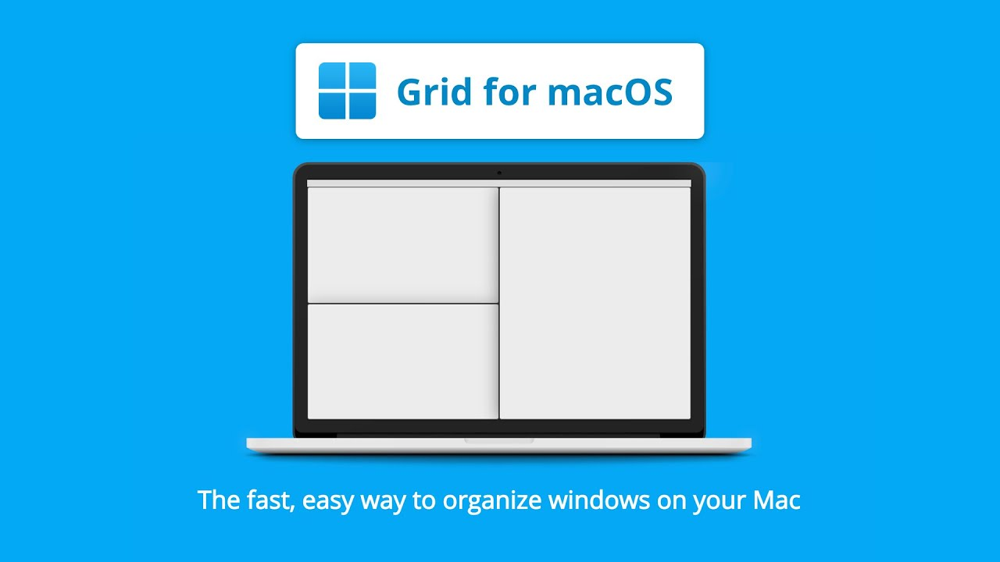
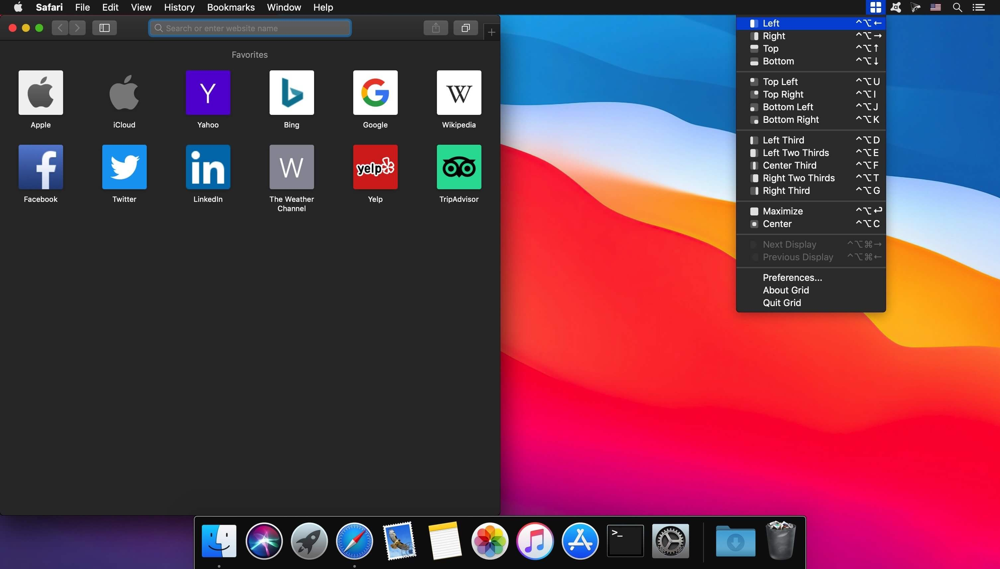

# Grid

## Overview
Grid is third-party software for MacOS that allows for much more efficient window management.
## Installation
To install Grid:

1. Go to:
   [MacGrid](https://macgrid.app) and download the .dmg file
2. Follow instructions in order to install software on your Mac.

## Setup

Grid will start automatically with OS startup.
While there are no predefined layers there is a multitude of options to choose from, as well as keybindings to use.

