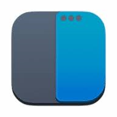
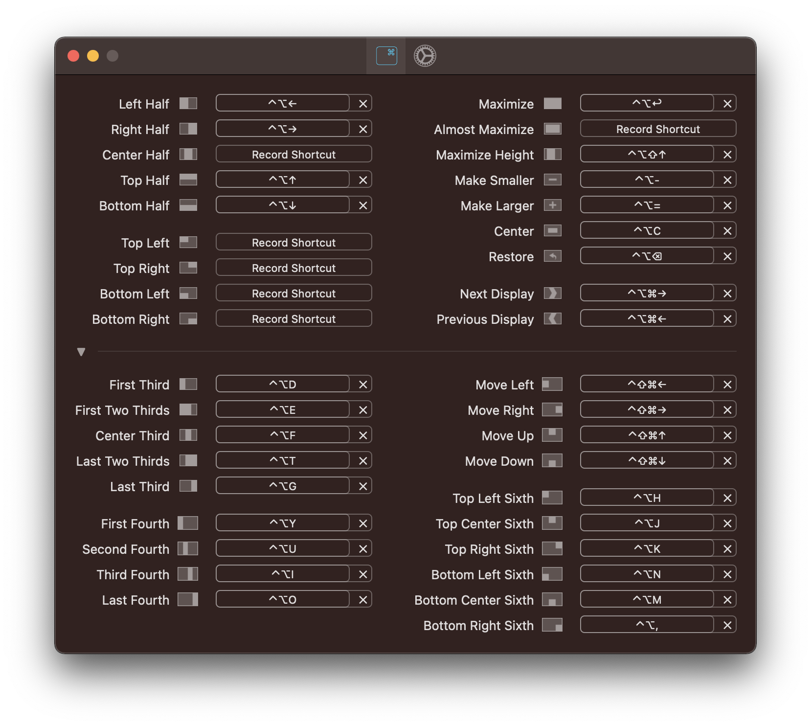

# Rectangle

Rectangle is a MacOS app that allows for window management based on either shortcuts or snapping functionlity.

The shortcuts that are used to control the size and placement of the window can be modified to your liking.

The app can be used for free but it has also paid version with extended functionality.

## Setup

1. Go to Rectangle.app
2. Download the .dmg file to install the app on your Mac
