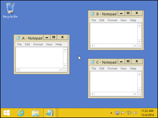

# AquaSnap

AquaSnap is free software with paid option to extend functionality, similar to PowerToys that allows for better window management in Windows OS.

Instead of being based on grid like PowerToys or WindowGrid that you can freely adjust it is based on snapping functionality.

## Setup

1. Go to [AquaSnap](https://www.nurgo-software.com/products/aquasnap)
2. Download the software.
3. Install it according to instructions.